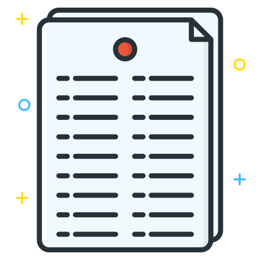
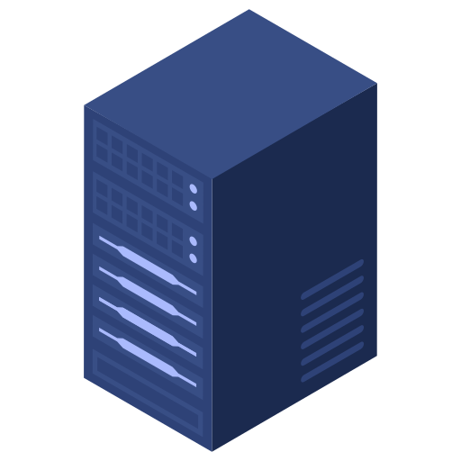
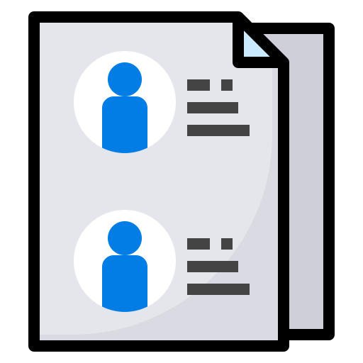

<h1> Projeto Lista de Tarefas </h1>

Este projeto consiste em um sistema que permite a criação de lista de tarefas desenvolvido com o framework .Net com a linguagem CSharp e um banco de dados MySQL.

Atualmente, apenas o backend do sistema foi implementado, e futuramente irei adicionar o frontend.

<h2> Objetivo</h2>

O foco deste projeto não se resume apenas na criação de um sistema de tarefas, mas também para entender mais sobre padrões de desenvolvimento de sistemas com o uso do Result Pattern e como tratar erros e exceções de forma eficiente e compreensível.

<h2> Como funciona?</h2>
<h3> Backend</h3>

O sistema estabelece uma conexão com um banco de dados MySQL para registrar as contas dos usuário, as tarefas e as listas criadas.

Utilizando um sistema de autenticação com tokens JWT (Json Web Tokens), um usuário, ao entrar em sua conta, irá receber um token de acesso e um token de recarga por cookies seguros.

O token de acesso contém informações sobre o usuário como seu ID, e-mail e nome. Este token é usado para autenticar o usuário, pois é necessário ter um token de acesso válido para ver, criar, editar e remover suas tarefas.

O token de recarga contém apenas o ID do usuário para poder validar o token enviado. Ele serve para gerar um novo token de acesso sem ter que entrar em sua conta novamente.

A validação do token de recarga ocorre com seu armazenamento no banco de dados. Dessa forma, consigo comparar se o token enviado por um usuário equivale ao token que o backend criou para ele, evitando envios de tokens falsos.

O envio é feito por cookies para evitar que os tokens sejam acessados por scripts no frontend e enviados em conexão não seguras, ou seja, são enviados apenas em conexões https.

O sistema utiliza o padrão resultado (result pattern) para enviar erros esperados caso uma tarefa não tenha êxito em sua função, e para enviar determinados dados caso uma tarefa tenha sucesso em sua função.

Esse padrão é utilizado pois evita consumir tempo e memória jogando vários tipos de exceções diferentes quando um erro esperado acontece. No entanto, se algo inesperado ocorrer, a classe GlobalExceptionHandler irá capturar a exceção e retornar uma mensagem de erro HTTP 500 Internal Server Error.

Portanto, para erros esperados, o padrão de resultado é utilizado, e para erros não esperados, um tratador de exceção global irá capturar essa exceção, colocá-la em um log e retornar uma mensagem HTTP 500 informando que algo inesperado aconteceu.

<h2> Tecnologias utilizadas</h2>
<h3> Backend</h3>
<ul>
	<li> <code>.Net</code>: para desenvolver o sistema backend.</l1>
	<li> <code>JWT</code>: para autenticar usuários e proteger o acesso aos seus dados.</li>
	<li> <code>Scalar</code>: para a documentação do sistema backend.</li>
</ul>

<h2>Demonstração</h2>
<h3> Backend</h3>
